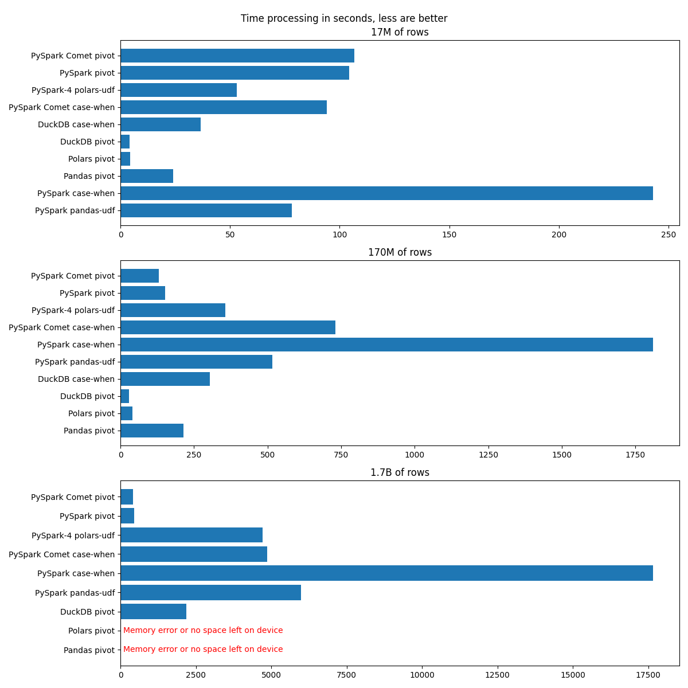

# Feature Generation Benchmark

[Detailed Results of the Benchmark](https://semyonsinchenko.github.io/feature-generation-benchmark/benchmark_results/);

## About

This project aims to create a DB-like benchmark of feature generation (or feature aggregation) task. Especially the task of generating ML-features from the time-series data. In other words it is a benchmark of ETL tools on the task of generating the single partition of the Feature Store.

See a detailed description on the [companion web-site](https://semyonsinchenko.github.io/feature-generation-benchmark/).

## Requirements

- [maturin](https://github.com/PyO3/maturin)
- [cargo](https://github.com/rust-lang/cargo)
- Python 3.11
- Java 8+ for PySpark

## Installation

(Linux)

1. `maturin build --release` for build a wheel
2. `python3 -m venv .venv` (python3.11 is required)
3. `source .venv/bin/activate`
4. `pip install target/wheels/data_generation-0.1.0-cp311-cp311-manylinux_2_34_x86_64.whl` (choose one for your system)

## Generate datasets

(Inside `venv` from the previous step)

- `generator --help`
- `generator --prefix test_data_tiny` (generate tiny data)
- `generator --prefix test_data_small --size small` (generate small data)

## Contributing

Contributions are very welcome. I created that benchmark not to prove that one framework is better than other. Also, I'm not related anyhow to any company that develops one or another ETL tool. I have some preferences to Apache Spark because I like it, but results and benchmark is quite fair. For example, I'm not trying to hide how faster are Pandas compared to Spark on small datasets, that are fit into memory.

What would be cool:

- [ ] Implement the same task in [DuckDB](https://duckdb.org/);
- [ ] Implement the same task in [Polars](https://pola.rs/);
- [ ] Implement the same task in [Dusk](https://www.dask.org/);
- [ ] Implement different approaches for `Pandas`;
- [ ] Implement different approaches for `Spark`;
- [ ] Setup CI to run benchmarks on GH Runners instead of my laptop;
- [ ] ???

There is a lack of documentation for now, but I'm working on it. You may open an issue, open a PR or just contact me via email: [mailto:ssinchenko@apache.org](mailto:ssinchenko@apache.org).
