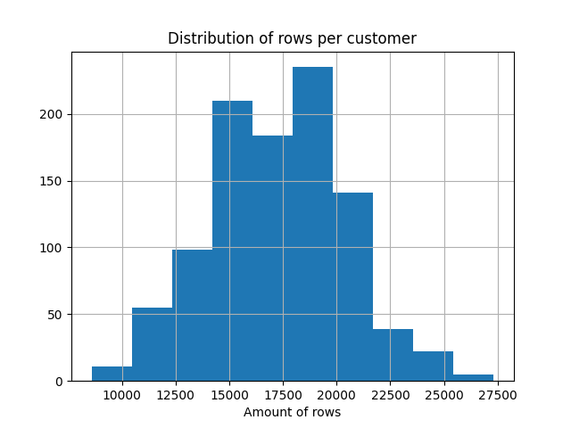

# Feature Generation Benchmark

## About the project

This project aims to create a DB-like benchmark of feature generation task. Especially for the task of generating ML-features from time-series data. In other words it is a benchmark of ETL tools on the task of generating the single partition of the Feature Store.

## About the task of Feature Generation

Today, in the era of ML-driver approach to the business, each company on the market is trying to use the data about it's customers. For modern banks such a data is, for example, a history of transactions. In a mobile game it may be, for example, the history of in-game purchases. For an online shop it may be, for example, the history of orders.

The typical ML-task on such a data may be, for example:

- predict the next best offer of the product per customer;
- predict the expected life-time-value of the customer;
- predict the customers attrition;

And a lot of other interesting and useful for the business tasks. For a good overview you may check the book [Introduction to Algorithmic Marketing](https://www.algorithmicmarketingbook.com/).

### Features from Time Series data

When we have time-series data, but need to make a prediction on the level of the primary key (customer ID, for example), we need to generate features first. A very common approach is just to compute different aggregations, like min, max, average, count, etc. But not on the level of the whole data, but on the level of different groupings and time windows. For example, we may want to calculate something like average customer spending in category "Health" from a Debit Card for the last three months.

In a result the transforms to an ETL (Extract-Transform-Load) pipeline with a very specific profile, when we have a very long table with about 5 columns and we need to transform it to the short, but very wide table with about thousand of columns. Another problem is that such a pipeline is very hard to explain in pure SQL.

### The Feature Store approach

Because generating thousand of features may be a complex task, it is a common way to create a table with precomputed features. That table is named "Feature Store".

Such a table is typically has a structure with two primary keys (ID of customer, Timestamp mark of the data for which features are up to date):

| customer_id | features_timestamp | feature1 | ... | featureN |
| ----------- | ------------------ | -------- | --- | -------- |
| id1         | 2024-05-12         | 1        | ... | 1000     |
| id1         | 2024-05-13         | 3        | ... | 500      |
| id2         | 2024-05-12         | -1       | ... | 750      |

## Motivation

There is a well know [TPC-H bechmark](https://www.tpc.org/tpch/) on which the most of ETL-tools are compete. The problem of that benchmark is that it is about DWH-like workload that is slightly different from ML-like Feature Generation workload.

My benchmark is specified by the following:

1. Synthetic data that simulates transactions of bank customers;
2. Fully reproducible data: generation is SEED based;
3. CLI for generating data of different sizes, starting from small and finishing with a quite big dataset;
4. Skew in keys that simulates real-life cases: there are always customers who make much more transactions per day; or categories that are much popular than other;
5. Generated data is partitioned by an offset (depends of the size it may be daily partitions, monthly partitions, etc.);
6. Generated data is already in columnar data format ([Apache Parquet](https://parquet.apache.org/));

## Description of the testing data

As input we have the long table of customer transactions in the form of:

| customer_id | card_type | trx_type | channel | trx_amnt | t_minus | part_col |
|-------------|-----------|----------|---------|----------|---------|----------|
| Long        | String    | String   | String  | Double   | Long    | String   |

### Schema description

**customer_id**

Is a unique ID of our customer. Just an incremental Long value, started from zero. Amount of rows per customers depends of expected transactions per day.



**card_type**

Is a category variable that may have values DC (Debit Card) and CC (Credit Card). DC appears with probability 75%:

| DC         | CC        |
|------------|-----------|
| 12,972,530 | 4,326,925 |

(Distribution for tiny dataset)

**trx_type**

Is a category variable with 13 unique values. No skew.

**channel**

Is a category variable with 2 unique values (mobile, classic). Mobile appears with probability 75%:

| mobile     | classic   |
|------------|-----------|
| 12,976,058 | 4,323,397 |

(Distribution for tiny dataset**

**trx_amnt**

Is a double variable that is used for next aggregations. Uniformly distributed random value.

**t_minus**

Is a Long value that represents the time. It's value is an offset from the reference date.

**part_col**

Partition column. There are two reasons of that variable:

- an ability to generate out-of-core datasets;
- a simulation of actual pipelines when data is almost always partitioned in a [Hive-style](https://athena.guide/articles/hive-style-partitioning).


## Description of the Feature Generation task

### Aggregations

Our goal is to generate the following aggregations:

- min;
- max;
- avg;
- sum;
- count;

The aggregations are always computed for **trx_amnt** column.

### Groupings

We should compute aggregations defined above for the following groups:

- all combinations of **card_type** and **trx_type**;
- all combinations of **channel** and **trx_type**;

### Time intervals

We should compute all aggregations for all the groups defined above for the following intervals:

- last week (**t_minus** <= 7);
- last two weeks (**t_minus** <= 14);
- last three weeks (**t_minus** <= 21);
- last month (**t_minus** <= 30);
- last three months (**t_minus** <= 90);
- last half of the year (**t_minus** <= 180);
- last year (**t_minus** <= 360);
- last two years (**t_minus** <= 720);

## Dummy implementation in Pandas as an example

```python
import pandas as pd


def generate_pivoted_batch(data: pd.DataFrame, t_minus: int, groups: list[str]) -> pd.DataFrame:
    pre_agg = (
        data.loc[data["t_minus"] <= t_minus]
        .groupby(["customer_id"] + groups, as_index=False)["trx_amnt"]
        .agg(["count", "mean", "sum", "min", "max"])
    )
    pivoted = pre_agg.pivot(
        columns=groups,
        index="customer_id",
        values=["count", "mean", "sum", "min", "max"],
    )
    pivoted.columns = ["_".join(a[1:]) + f"_{t_minus}d_{a[0]}" for a in pivoted.columns.to_flat_index()]
    return pivoted
```

Such a function do the following:

- filter data by the **t_minus** to select only rows, related to the category;
- group data by **customer_id** and given grouping columns;
- compute all required aggregations;
- make a pivot to transform **customer_id** to index and grouping categories to new columns;
- rename output columns and make an index flatten;


```python
dfs_list = []

for win in WINDOWS_IN_DAYS:
    # Iterate over combination card_type + trx_type
    dfs_list.append(generate_pivoted_batch(data, win, ["card_type", "trx_type"]))

    # Iterate over combination channel + trx_type
    dfs_list.append(generate_pivoted_batch(data, win, ["channel", "trx_type"]))

(
    reduce(lambda a, b: pd.merge(a, b, left_index=True, right_index=True), dfs_list)
    .reset_index(drop=False)
    .to_parquet("../tmp_out")
)
```

The last step is just to iterate over required time offset, compute batches and finally join all of them together using the fact, that **customer_id** is an index.
